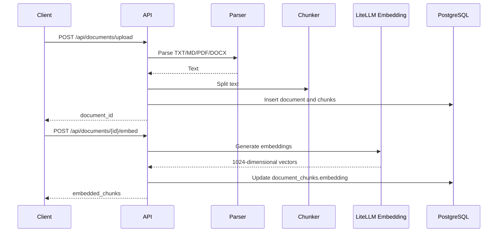
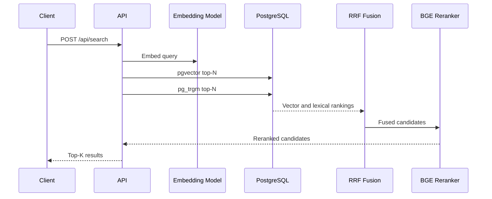

# Architecture

## Goals

The project focuses on a reproducible RAG backend rather than a single-file demo.

Primary goals:

- Keep ingestion and retrieval independently testable.
- Use PostgreSQL for relational data, metadata, vectors, and lexical retrieval.
- Keep model access behind LiteLLM.
- Record model calls and latency with Langfuse.
- Evaluate retrieval changes with a repeatable dataset and metrics.

## Components

### FastAPI

Provides REST endpoints for health checks, document upload, embedding, search, and RAG chat.

### PostgreSQL

Stores document metadata and chunk content.

### pgvector

Stores 1024-dimensional embeddings and provides HNSW cosine-distance retrieval.

### pg_trgm

Provides character trigram similarity for lexical recall. This is intentionally lightweight and does not require a separate search service.

### Reciprocal Rank Fusion

Fuses vector and lexical rankings without directly combining incompatible score scales.

### BGE Reranker

Reranks the fused candidate set using `BAAI/bge-reranker-v2-m3`.

If reranking fails, the service falls back to the RRF ranking.

### LiteLLM

Provides a unified interface for OpenAI-compatible embedding and chat providers.

### Langfuse

Records traces for:

- query embedding
- document embedding
- reranking
- RAG chat

## Ingestion Sequence



## Retrieval Sequence



## Failure Behavior

- Unsupported document formats return HTTP 415.
- Invalid or encrypted PDFs return HTTP 400.
- Embedding failures return HTTP 502.
- Rerank failures fall back to the RRF result.
- Database failures roll back the transaction.
## Streaming RAG

The stream endpoint uses Server-Sent Events.

Sequence:

```text
retrieve sources
-> emit sources event
-> stream model tokens
-> emit token events
-> finish Langfuse generation
-> emit done event
```

Non-streaming and streaming chat use the same context construction and prompt logic. The streaming endpoint only changes how the model response is delivered to the client.
